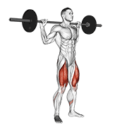
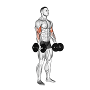

<div align="center">

# 💪 Exercises Dataset

[English](README.md) · [简体中文](README.zh-CN.md) · **日本語**

<p>
  
  
  
  
  
  
</p>

**すぐに使える包括的なフィットネス運動データセットです。1,324 種目を収録し、各種目にアニメーション GIF、180×180 のサムネイル画像、カテゴリー、身体部位、器具、ターゲット、筋群データ、および 10 言語（英語、スペイン語、イタリア語、トルコ語、ロシア語、中国語、ヒンディー語、ポーランド語、韓国語、フランス語）の手順説明が付属します。**

[](data/exercises.json)
[](videos/)
[](images/)
[](#-概要)
[](https://github.com/hasaneyldrm/logpress-public)
[](LICENSE)

</div>

> **📱 [LogPress](https://github.com/hasaneyldrm/logpress-public) アプリを支えるデータセット** — LogPress は AI 支援型のワークアウト記録アプリで、このデータセットが運動データ層を担っています。独自のフィットネスアプリを構築する場合は、そのままバックエンドに組み込めます。

---

## 📦 データソース

**このリポジトリが提供するもの：**

- カテゴリー、身体部位、器具、ターゲット、筋群データを含む 1,324 種目
- 各種目のアニメーション GIF と 180×180 サムネイル（メディア © [Gym visual](https://gymvisual.com/) — [ライセンスと利用](#-ライセンスと利用)を参照）
- 10 言語の手順説明（🇬🇧 英語、🇪🇸 スペイン語、🇮🇹 イタリア語、🇹🇷 トルコ語、🇷🇺 ロシア語、🇨🇳 中国語、🇮🇳 ヒンディー語、🇵🇱 ポーランド語、🇰🇷 韓国語、🇫🇷 フランス語）
- インタラクティブブラウザー（`index.html`）と開発者向けセットアップガイド（`setup.html`）

---

## 📋 目次

- [データソース](#-データソース)
- [概要](#-概要)
- [インタラクティブブラウザーと開発者向けセットアップ](#-インタラクティブブラウザーと開発者向けセットアップ)
- [ファイル構成](#-ファイル構成)
- [統計](#-統計)
- [データスキーマ](#-データスキーマ)
- [運動の例](#-運動の例)
- [使用例](#-使用例)
- [ライセンスと利用](#-ライセンスと利用)

---

## 🔍 概要

このデータセットは、教育および研究目的で厳選された **1,324 種類のフィットネス運動**のコレクションです。幅広い筋群、器具の種類、運動カテゴリーを網羅しており、次の用途に適しています。

- フィットネスアプリやワークアウト計画アプリの構築
- 運動認識や推薦を扱う機械学習プロジェクト
- 健康・ウェルネス研究
- 教育用デモやプロトタイプ

各運動エントリーには次の情報が含まれます。

| フィールド | 説明 |
|---|---|
| 一意の ID | 数値識別子（例：`"0001"`） |
| 名前 | 説明的な運動の正式名称 |
| カテゴリー | 主に鍛える筋群 |
| ターゲット | 具体的な対象筋 |
| 筋群 | 補助筋／協働筋 |
| 器具 | 必要な器具（自重運動は `body weight`） |
| 手順 | 各運動の段階的な説明 |
| 対応言語 | 🇬🇧 英語 · 🇪🇸 スペイン語 · 🇮🇹 イタリア語 · 🇹🇷 トルコ語 · 🇷🇺 ロシア語 · 🇨🇳 中国語 · 🇮🇳 ヒンディー語 · 🇵🇱 ポーランド語 · 🇰🇷 韓国語 · 🇫🇷 フランス語 |
| メディア | 各運動の 180×180 サムネイル（`image`）とアニメーション GIF（`gif_url`）— メディア © Gym visual、[ライセンスと利用](#-ライセンスと利用)を参照 |

---

## 🖥️ インタラクティブブラウザーと開発者向けセットアップ

このリポジトリには、すぐに使える 2 つの HTML ツールが含まれています。サーバーは不要で、ブラウザーで開くだけです。

> **注：**ブラウザーには、各運動の 180×180 サムネイルとアニメーション GIF が、メタデータおよび手順とともに表示されます。

### `index.html` — 運動ブラウザー

完全にクライアント側で動作する運動エクスプローラーで、次の機能があります。
- 全 1,324 種目を対象とするライブ検索
- カテゴリー、器具、ターゲット筋による絞り込み
- 無限スクロールグリッド
- カードをクリックして、完全な詳細と英語、スペイン語、イタリア語、トルコ語、ロシア語、中国語、ヒンディー語、ポーランド語、韓国語、フランス語の手順を表示

### `setup.html` — 開発者向けセットアップガイド

データセットを独自のアプリケーションに統合するための段階的なガイドです。

1. **データベース設定** — SQL Server、PostgreSQL、MySQL、SQLite 向けの `CREATE TABLE` SQL を提供します。1,324 件すべての INSERT 文を含む実行可能な `.sql` ファイルを、ブラウザーだけで生成できます。
2. **API 統合** — バックエンド API の呼び出し方を示す、コピー＆ペースト可能な **JavaScript、Python、C#、Java、PHP、Go、cURL** のクライアントコードを提供します。ベース URL を入力すると、すべての例がリアルタイムで更新されます。
3. **LLM に質問** — フレームワークとデータベースを選べる構造化プロンプトを ChatGPT、Claude、Gemini に貼り付けると、本番利用可能な完全な REST API を一度に生成できます。Express.js、FastAPI、ASP.NET Core、Spring Boot、Laravel、Gin に対応しています。

---

## 📂 ファイル構成

```
exercises-dataset/
├── data/
│   ├── exercises.json        # Full dataset — 1,324 exercise records (JSON array)
│   └── exercises.schema.json # JSON Schema (2020-12) describing every record
├── images/                  # 1,324 × 180×180 thumbnails  (© Gym visual)
├── videos/                  # 1,324 × 180×180 animation GIFs  (© Gym visual)
├── index.html               # Interactive exercise browser (client-side, no server needed)
├── setup.html               # Developer setup guide (DB import + API integration)
├── NOTICE.md                # Media attribution & license terms
└── README.md
```

### 主なファイル

- **`data/exercises.json`** — 主要なデータファイルです。全メタデータを含む 1,324 個の運動オブジェクトからなる JSON 配列です。`image` と `gif_url` はローカルの 180×180 アセットを指し、各レコードには `attribution` フィールドがあります。`media_id` には元のメディア参照 ID が入ります。
- **`data/exercises.schema.json`** — 各フィールド、その型、制約を正式に記述する [JSON Schema](https://json-schema.org/)（Draft 2020-12）です。標準的な JSON Schema バリデーターでデータセットや独自の追加内容を検証できます。
- **`images/`、`videos/`** — 180×180 のサムネイルとアニメーション GIF（© [Gym visual](https://gymvisual.com/)、許可を得て使用）。
- **`index.html`** — スタンドアロンの運動ブラウザーです。任意のモダンブラウザーで直接開けます。
- **`setup.html`** — DB 設定、API 統合、LLM 支援によるバックエンド生成の開発者向けガイドです。
- **`LICENSE`、`NOTICE.md`** — MIT（コード／データ）と Gym visual のメディア利用条件です。

---

## 📊 統計

| 指標 | 件数 |
|---|---|
| 運動の総数 | **1,324** |
| 手順の言語数 | **10** |

### 身体部位別の運動数

| 身体部位 | 運動数 |
|---|---|
| 上腕 | 292 |
| 大腿部 | 227 |
| 背中 | 203 |
| 腰部 | 169 |
| 胸 | 163 |
| 肩 | 143 |
| 下腿 | 59 |
| 前腕 | 37 |
| 有酸素運動 | 29 |
| 首 | 2 |

### 器具別の運動数

| 器具 | 運動数 |
|---|---|
| 自重 | 325 |
| ダンベル | 294 |
| ケーブル | 157 |
| バーベル | 154 |
| レバレッジマシン | 81 |
| バンド | 54 |
| スミスマシン | 48 |
| ケトルベル | 41 |
| 加重 | 36 |
| スタビリティボール | 28 |
| EZ バーベル | 23 |
| その他 | 83 |

> **注：**運動の約 25% は器具をまったく必要としないため、自宅トレーニング用アプリに最適です。

---

## 🗂️ データスキーマ

`data/exercises.json` の各レコードは次の構造に従います。検証用に、機械可読な [JSON Schema](data/exercises.schema.json) も用意されています。

| フィールド | 型 | 説明 |
|---|---|---|
| `id` | `string` | 一意の数値識別子（例：`"0001"`） |
| `name` | `string` | 完全な運動名（例：`"3/4 Sit-up"`） |
| `category` | `string` | 身体部位カテゴリー（例：`"upper arms"`、`"chest"`、`"back"`） |
| `body_part` | `string` | `category` と同じ — 対象とする身体部位 |
| `equipment` | `string` | 必要な器具（例：`"dumbbell"`、`"body weight"`） |
| `instructions.en` | `string` | 英語による完全な手順説明 |
| `instructions.es` | `string` | スペイン語による完全な手順説明 |
| `instructions.it` | `string` | イタリア語による完全な手順説明 |
| `instructions.tr` | `string` | トルコ語による完全な手順説明 |
| `instructions.ru` | `string` | ロシア語による完全な手順説明 |
| `instructions.zh` | `string` | 中国語による完全な手順説明 |
| `instructions.hi` | `string` | ヒンディー語による完全な手順説明 |
| `instructions.pl` | `string` | ポーランド語による完全な手順説明 |
| `instructions.ko` | `string` | 韓国語による完全な手順説明 |
| `instructions.fr` | `string` | フランス語による完全な手順説明 |
| `instruction_steps.<lang>` | `array[string]` | 言語ごとに同じ手順を順序付き配列へ分割したもの（`en`、`es`、`it`、`tr`、`ru`、`zh`、`hi`、`pl`、`ko`、`fr`） |
| `muscle_group` | `string` | 主な協働筋群 |
| `secondary_muscles` | `array[string]` | 関与する追加の筋肉 |
| `target` | `string` | 主なターゲット筋（例：`"biceps"`、`"pectoralis major"`） |
| `media_id` | `string` | 元のメディア参照 ID（例：`"2gPfomN"`） |
| `image` | `string` | 180×180 サムネイルへのパス（例：`"images/0001-2gPfomN.jpg"`） |
| `gif_url` | `string` | 180×180 アニメーション GIF へのパス（例：`"videos/0001-2gPfomN.gif"`） |
| `attribution` | `string` | メディアの著作権表示 — `"© Gym visual — https://gymvisual.com/"` |
| `created_at` | `string` | レコード作成時刻の ISO 8601 タイムスタンプ |

### サンプルレコード

```json
{
  "id": "0001",
  "name": "3/4 sit-up",
  "category": "waist",
  "body_part": "waist",
  "equipment": "body weight",
  "instructions": {
    "en": "Lie flat on your back with your knees bent and feet flat on the ground. Place your hands behind your head with your elbows pointing outwards. Engaging your abs, slowly lift your upper body off the ground, curling forward until your torso is at a 45-degree angle. Pause for a moment at the top, then slowly lower your upper body back down to the starting position. Repeat for the desired number of repetitions.",
    "es": "Túmbate sobre tu espalda con las rodillas flexionadas y los pies apoyados en el suelo. ...",
    "it": "Sdraiati sulla schiena con le ginocchia piegate e i piedi appoggiati a terra. ...",
    "tr": "Sırt üstü yatın, dizlerinizi bükün ve ayaklarınızı yere düz koyun. ...",
    "ru": "Лягте на спину, согните колени и поставьте ступни на землю. ...",
    "zh": "平躺，膝盖弯曲，双脚平放在地上。...",
    "hi": "अपने घुटनों को मोड़कर और पैरों को ज़मीन पर सपाट रखते हुए अपनी पीठ के बल लेट जाएँ।...",
    "pl": "Połóż się płasko na plecach, ugnij kolana i oprzyj stopy płasko na pod ...",
    "ko": "등을 바닥에 누워 무릎을 구부리고 발을 바닥에 붙입니다. ...",
    "fr": "Allonge-toi sur le dos, les genoux fléchis et les pieds à plat au sol. ..."
  },
  "muscle_group": "hip flexors",
  "secondary_muscles": ["hip flexors", "lower back"],
  "target": "abs",
  "media_id": "2gPfomN",
  "image": "images/0001-2gPfomN.jpg",
  "gif_url": "videos/0001-2gPfomN.gif",
  "attribution": "© Gym visual — https://gymvisual.com/",
  "created_at": "2026-03-18T12:31:32.854798+00:00"
}
```

---

## 🎬 運動の例

> 各例には 180×180 のサムネイル（`image`）とアニメーション GIF（`gif_url`）が付属します。© [Gym visual](https://gymvisual.com/)。

### 1 — バーベル・ベンチプレス · 胸


> **器具：**バーベル · **ターゲット：**胸筋 · **補助：**上腕三頭筋、肩 · **メディア ID：**`EIeI8Vf`

バーベル・ベンチプレスは胸のトレーニングの基礎であり、パワーリフティングの「ビッグ 3」の一つです。ベンチに仰向けになり、負荷をかけたバーベルを胸まで下ろしてから、力強く押し上げます。胸筋、上腕三頭筋、三角筋前部を同時に動員するため、上半身のプッシュ力と胸の筋量を伸ばすうえで最も効果的な単一種目の一つです。

**重要なポイント：**ラックから外す前に肩甲骨を寄せて下げます。足裏を床につけ、腰は自然に反らし、肩幅のグリップを保ちます。バーをコントロールしながら胸の中央まで下ろし、かかとから力を伝えて押し上げます。

### 2 — バーベル・デッドリフト · 大腿部／背中


> **器具：**バーベル · **ターゲット：**臀筋 · **補助：**ハムストリングス、腰部 · **メディア ID：**`ila4NZS`

バーベル・デッドリフトは、究極の全身筋力運動として広く認められています。臀筋、ハムストリングス、腰部という後面連鎖の主要筋群をほぼすべて動員しながら、上背部、僧帽筋、握力にも大きな働きを求めます。正しい脊柱の配列とブレーシング技術は、パフォーマンスと安全性の両方に不可欠です。

**重要なポイント：**バーを足の中央の真上に置きます。股関節から折り、脚のすぐ外側でバーを握り、体幹を強く固め、挙上中はバーをすねに沿わせます。床を押し離すように立ち上がり、頂点で臀筋を締めて股関節を完全に伸ばし、ロックアウトします。

### 3 — バーベル・フルスクワット · 大腿部


> **器具：**バーベル · **ターゲット：**臀筋 · **補助：**大腿四頭筋、ハムストリングス、ふくらはぎ、体幹 · **メディア ID：**`qXTaZnJ`

「すべての運動の王様」とも呼ばれるバーベル・フルスクワットは、下半身全体と体幹の協調した筋力を必要とします。パーシャルスクワットと比べて、平行より深くしゃがむことで臀筋とハムストリングスを最大限に活性化します。ほぼすべての筋力・筋肥大プログラムの基礎となる種目です。

**重要なポイント：**バーを僧帽筋上部（ハイバー）または三角筋後部（ローバー）に置きます。下降前に体幹を固め、膝をつま先と同じ方向へ外に押し、股関節へ座り込むようにして、太ももが床と平行より下になるまで下げます。足裏全体で押して立ち上がります。

### 4 — ダンベル・バイセップスカール · 上腕


> **器具：**ダンベル · **ターゲット：**上腕二頭筋 · **補助：**前腕 · **メディア ID：**`NbVPDMW`

ダンベル・バイセップスカールは、腕のアイソレーション種目として最も広く知られています。左右を独立して鍛えることで、両肢の筋力差を見つけて修正できます。回外位（手のひらを上向き）のグリップは、動作の頂点で上腕二頭筋の収縮を最大化します。

**重要なポイント：**直立し、肘を体側に固定します。持ち上げながら手首を回外し、頂点で絞り、反動を使わずコントロールして下ろします。肩や腰の勢いを使わないでください。

### 5 — プルアップ · 背中


> **器具：**自重 · **ターゲット：**広背筋 · **補助：**上腕二頭筋、前腕 · **メディア ID：**`lBDjFxJ`

プルアップは上半身のプル力を測る自重運動のゴールドスタンダードです。主に広背筋を発達させ、理想的な V 字型の背中を作ると同時に、上腕二頭筋、三角筋後部、体幹の安定筋も大きく関与します。初心者向けのバンド補助から上級者向けの加重まで調整できます。

**重要なポイント：**肩幅またはやや広めのオーバーハンドグリップで、完全にぶら下がります。肩甲骨を下げて広背筋から動作を開始し、胸をバーへ引き寄せます。可動域を保つため、反復のたびに完全に下ろします。

### 6 — ダンベル・ラテラルレイズ · 肩


> **器具：**ダンベル · **ターゲット：**三角筋 · **補助：**僧帽筋 · **メディア ID：**`DsgkuIt`

ダンベル・ラテラルレイズは肩幅を作る代表的なアイソレーション種目です。幅広い肩の見た目を生み出す三角筋外側部（中部）を直接狙います。負荷の重さよりも、制御されたテンポと厳密なフォームの方がはるかに重要です。

**重要なポイント：**立った状態で、肘を常にわずかに曲げます。腕が床と平行になるまでダンベルを横へ上げ、それ以上は上げません。手首ではなく肘から動かします。筋肉に負荷がかかる時間を最大化するため、コントロールしながらゆっくり下ろします。

---

## 🚀 使用例

### Python — 読み込みと絞り込み

```python
import json

with open("data/exercises.json", "r", encoding="utf-8") as f:
    exercises = json.load(f)

print(f"Total exercises loaded: {len(exercises)}")

# Filter by category
chest_exercises = [ex for ex in exercises if ex["category"] == "chest"]
print(f"Chest exercises: {len(chest_exercises)}")
# -> Chest exercises: 163

# Filter by equipment
bodyweight = [ex for ex in exercises if ex["equipment"] == "body weight"]
print(f"Bodyweight exercises: {len(bodyweight)}")
# -> Bodyweight exercises: 325

# Get all unique categories
categories = sorted({ex["category"] for ex in exercises})
print("Categories:", categories)

# Access multilingual instructions
ex = exercises[0]
print(ex["instructions"]["en"])  # English
print(ex["instructions"]["es"])  # Spanish
print(ex["instructions"]["it"])  # Italian
print(ex["instructions"]["tr"])  # Turkish
print(ex["instructions"]["ru"])  # Russian
print(ex["instructions"]["zh"])  # Chinese
print(ex["instructions"]["hi"])  # Hindi
print(ex["instructions"]["pl"])  # Polish
print(ex["instructions"]["ko"])  # Korean
print(ex["instructions"]["fr"])  # French
```

### Python — Pandas で読み込む

```python
import json
import pandas as pd

with open("data/exercises.json", "r", encoding="utf-8") as f:
    data = json.load(f)

df = pd.DataFrame(data)

# Top categories by exercise count
print(df["category"].value_counts().head(10))

# All barbell exercises targeting upper legs
barbell_quads = df[(df["equipment"] == "barbell") & (df["category"] == "upper legs")]
print(barbell_quads[["name", "target", "equipment"]])
```

### JavaScript / Node.js

```js
const exercises = require("./data/exercises.json");

console.log(`Total exercises: ${exercises.length}`);

// Bodyweight exercises only
const bodyweight = exercises.filter(ex => ex.equipment === "body weight");
console.log(`Bodyweight exercises: ${bodyweight.length}`);
// -> Bodyweight exercises: 325

// Group exercises by category
const byCategory = exercises.reduce((acc, ex) => {
  acc[ex.category] = (acc[ex.category] || []);
  acc[ex.category].push(ex);
  return acc;
}, {});

// Access multilingual instructions
const ex = exercises[0];
console.log(ex.instructions.en); // English
console.log(ex.instructions.es); // Spanish
console.log(ex.instructions.it); // Italian
console.log(ex.instructions.tr); // Turkish
console.log(ex.instructions.ru); // Russian
console.log(ex.instructions.zh); // Chinese
console.log(ex.instructions.hi); // Hindi
console.log(ex.instructions.pl); // Polish
console.log(ex.instructions.ko); // Korean
console.log(ex.instructions.fr); // French
```

### TypeScript — 型安全な使用方法

```typescript
interface Exercise {
  id: string;
  name: string;
  category: string;
  body_part: string;
  equipment: string;
  instructions: {
    en: string;
    es: string;
    it: string;
    tr: string;
    ru: string;
    zh: string;
    hi: string;
    pl: string;
    ko: string;
    fr: string;
  };
  instruction_steps: {
    en: string[];
    es: string[];
    it: string[];
    tr: string[];
    ru: string[];
    zh: string[];
    hi: string[];
    pl: string[];
    ko: string[];
    fr: string[];
  };
  muscle_group: string;
  secondary_muscles: string[];
  target: string;
  media_id: string;
  image: string;
  gif_url: string;
  attribution: string;
  created_at: string;
}

import exercises from "./data/exercises.json";
const data = exercises as Exercise[];

const randomWorkout: Exercise[] = data.slice(0, 6);
console.log("First 6 exercises:", randomWorkout.map(e => e.name));
```

---

## 📄 ライセンスと利用

このリポジトリは、運動のメタデータ、多言語の手順翻訳、180×180 の運動メディアを含む**開発者向けセットアップウィザード兼構造化運動データセット**です。

- **コード、ツール、データセット構造、手順テキスト**は [MIT License](LICENSE) の下で公開されています。
- **運動メディア（画像と GIF）の著作権は © [Gym visual](https://gymvisual.com/) に帰属**し、許可を得て 180×180 の解像度で再配布されています。詳細は [`NOTICE.md`](NOTICE.md) と [`LICENSE`](LICENSE) のメディア例外条項を参照してください。`© Gym visual — https://gymvisual.com/` の帰属表示を維持する必要があります。再利用には [Gym visual の利用規約](https://gymvisual.com/content/3-terms-and-conditions-of-use)が適用されるため、メディアを再利用する前に同社から独自のライセンスを取得してください。
- このリポジトリは、基礎となる運動コンテンツやメディアの所有権を**主張しません**。
